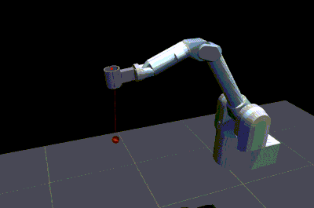
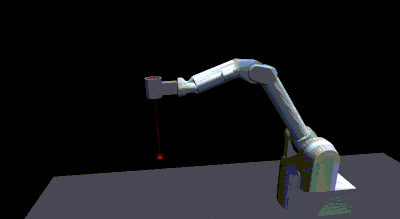
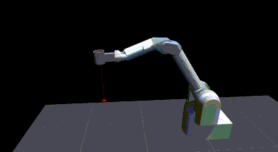

# Bachelor Thesis at Karlsruhe Institute for Technology
I wrote my bachelor thesis at the
[ALR group](https://alr.anthropomatik.kit.edu/).
The main goal of the thesis was to improve
the sample efficiency of the MORE [1] algorithm.
The MORE algorithm is a stochastic search algorithm that
can be used for optimization problems. A key step of the 
MORE algorithm is approximating the often complex original object
function with a quadratic surrogate model.
In the field of 
robotics we can use it for model-free policy search, a subfield of 
reinforcement learning. 
The original code for the MORE algorithm is based on a version from
[Maximilian Hüttenrauch](https://github.com/maxhuettenrauch/MORE).

The main idea for the thesis was to
use recursive estimation techniques like the Kalman filter and
Recursive Least Squares for estimation of the surrogate model which I
implemented from scratch. The MORE version with recursive surrogate-modeling
is benchmarked on the rosenbrock function, a simple planar reaching task
and on a simulation of ball-in-a-cup task using MuJoCo with the
Barret WAM robot arm. Dynamic Movement Primitives are used
to parameterize the movement task, the resulting parameters can
then be optimized by the MORE algorithm.

In the reaching task the end effector of the robot arm
has to pass through two via-points at a specified time.
The following picture shows a simple planar robot arm with
5-links, where darker contours of arm are later in time.
The via-points that have to be reached are marked with a red cross.
The reward based on the distance to the via-points at specific
timesteps.

For the ball-in-the-cup-task 
the reward signal is based on calculating the
distance d from the center of the cup to the ball.
![Illustration for reward calculation (Picture from [2])](resources/cup_reward.png)

Some solution for the ball-in-the-cup-task obtained by using
MORE with recursive surrogate-modeling:

[1] (Model-Based Relative Entropy Stochastic Search, Abdolmaleki et al. 2015)
[2] (Kober, Jens, and Jan Peters. "Policy search for motor primitives in robotics.")
